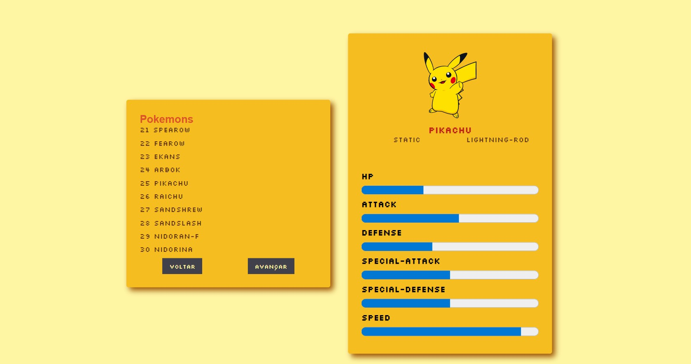

# Catálago de Pokemon

Esse projeto tem como objetivo criar um catálago de pokemon utilizando front-end utilizando a PokeApi para consumir os dados e mostrá-los na tela.


## Layout da Aplicação




## Stack utilizada

**Linguagem:** Javascript

**Framework:** React.js

**Tecnologia:** Poke Api


## Pré-requisitos

Antes de iniciar, se assegure que possui:

- Node
- NPM
- Git

Para verificar qual a sua versão do npm e node basta rodar os códigos a seguir:

```bash
  npm -v 
  npx -v 
```
Se houver, aparecerá a versão disponível de cada um.


## Instalações

Clone o projeto

```bash
  git clone https://github.com/laissafernandes/desafioSomoSfront
```

Instalação do React:
```bash
 npx create-react-app my-app
```
Entre no diretório do projeto

```bash
  cd my-app
```

Instale as dependências

```bash
  npm install
```

Inicie o servidor

```bash
  npm start
```
O aplicativo será aberto no navegador como: http://localhost:3000
## 🚀 Sobre mim
Eu sou uma pessoa recém formada em um bootcamp de Web Dev Full Stack. E atualmente estou em transição de carreira. Venho da química mas, desde 2021 estou imersa no mundo da programação e estou amando esse processo. 


## 🔗 Contato

[](https://www.linkedin.com/in/laissafernandes)


